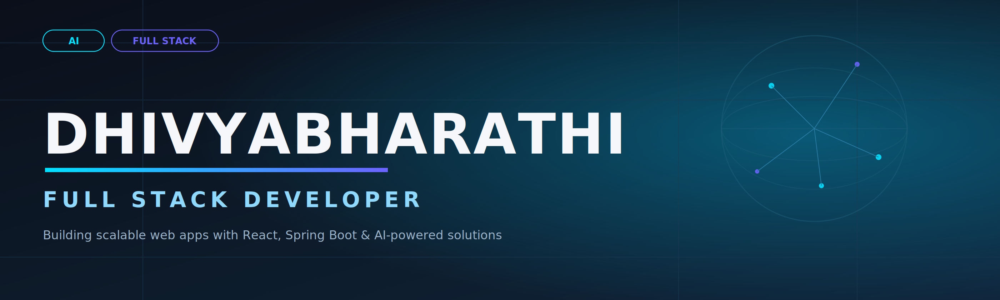

<p align="center">
  <a href="https://linkedin.com/in/dhivyabharathi-n"></a>
  <a href="mailto:dhivyapillai2005@gmail.com"></a>
  <a href="https://dhivyan.netlify.app"></a>
  <a href="https://github.com/DhivyabharathiCSE"></a>
</p>

```bash
$ whoami
> Dhivyabharathi N — Full Stack Developer | AI Enthusiast | AWS Cloud Learner

$ cat current_focus.txt
> Building AI-integrated full stack systems, securing them properly, and
> leveling up on AWS Cloud along the way.
```

---

### About Me

- B.E. Computer Science Engineering (2023–2027), V.S.B Engineering College, Karur — CGPA 7.9
- Full stack developer building AI-driven web applications, currently deepening AWS Cloud, System Design, Spring Security & Docker
- Currently building **VisionSpeak AI**, a wearable vision assistant for the visually impaired
- Reach me at **dhivyapillai2005@gmail.com**

---

### Tech Stack

<table align="center">
<tr>
<td align="center"><b>Languages</b></td>
<td></td>
</tr>
<tr>
<td align="center"><b>Frontend</b></td>
<td></td>
</tr>
<tr>
<td align="center"><b>Backend</b></td>
<td></td>
</tr>
<tr>
<td align="center"><b>Database</b></td>
<td></td>
</tr>
<tr>
<td align="center"><b>Tools</b></td>
<td></td>
</tr>
<tr>
<td align="center"><b>Cloud</b></td>
<td></td>
</tr>
</table>

---

### Featured Projects

<br>

#### VisionSpeak AI — Smart Vision Assistant for the Visually Impaired

A wearable, AI-powered assistive system that helps visually impaired users understand their surroundings in real time — combining an ESP32-CAM feed with object detection, OCR, and voice output, plus an independent ultrasonic obstacle alert so safety warnings never wait on network or inference latency.

**Key Highlights**
- Real-time scene description and object detection from a live ESP32-CAM feed
- OCR-based text reading for signs, labels, and documents
- Voice output for hands-free, accessible interaction
- Ultrasonic obstacle alert runs independently on-device, decoupled from AI inference latency
- Built to a ~₹1,700–1,900 hardware budget, making it realistic for low-cost deployment

**Tech Stack**
<p>


</p>

🔗 **Repo:** [ADD_REPO_LINK_HERE](#)

<br>

---

<br>

#### SecureLens — Intelligent Web Threat Analysis & Phishing Detection Platform

A full-stack security platform that analyzes URLs and web content to flag phishing and web-based threats in real time, pairing a Spring Security-hardened backend with a lightweight, framework-free React frontend.

**Key Highlights**
- Real-time web threat and phishing analysis pipeline
- JWT-based authentication with BCrypt password hashing
- Secured API layer built on Spring Security 6

**Key Technologies**

| Layer      | Technology                    |
|------------|-------------------------------|
| Frontend   | React 18, React Router 6, Axios |
| Styling    | Pure CSS (no framework)       |
| Backend    | Spring Boot 3.2, Java 17      |
| Auth       | JWT (jjwt 0.11.5), BCrypt     |
| Database   | MySQL 8 + Spring Data JPA     |
| Security   | Spring Security 6             |

🔗 **Repo:** [ADD_REPO_LINK_HERE](#)

<br>

---

<br>

#### Smart Blood Donation & Emergency Request System

A full-stack platform connecting blood donors with those in urgent need — cutting the manual coordination typically required to match a donor to a request down to a searchable, real-time lookup, backed by an AI chatbot for instant donor support.

**Key Highlights**
- JWT-based secure authentication
- Searchable donor database with real-time request and inventory tracking
- Donation camp scheduling and management
- Google Gemini AI chatbot handling donor queries without manual staff intervention

**Tech Stack**
<p>


</p>

🔗 **Repo:** [ADD_REPO_LINK_HERE](#)

<br>

---

<br>

#### AI Powered Personalized Learning Path Generator

An AI-driven platform that analyzes a user's existing skills and career goals to generate a personalized learning roadmap, replacing generic course lists with a path targeted at the learner's specific target role.

**Key Highlights**
- Goal-based path generation using AI recommendations
- Skill-gap analysis to identify what to learn next
- Interactive dashboard to track progress toward the target role

**Tech Stack**
<p>


</p>

🔗 **Repo:** [ADD_REPO_LINK_HERE](#)

<br>

> ⚠️ Replace every `ADD_REPO_LINK_HERE` with the real GitHub URL before publishing — a placeholder link is the fastest way to lose a recruiter's trust.

---

### Experience

**Full Stack Development Intern** — *Livestream Technologies*
Built full stack web applications using React.js, Spring Boot, REST APIs, and MySQL in an Agile environment.

**Web Development Intern** — *Lets Game Tech*
Developed responsive web pages using HTML, CSS, and JavaScript.

---

### Certifications

- HackerRank SQL
- Infosys – Programming in Java
- Cisco – Cybersecurity Essentials
- AWS Cloud Practitioner Essentials

---

### GitHub Activity

<p align="center">
  
</p>

---

### What I'm Aiming For

Looking to grow into a role building AI-integrated full stack systems — combining practical software engineering with applied AI, and continuing to build toward AWS Cloud proficiency along the way.

---

### Connect with Me

<p align="center">
  <a href="https://linkedin.com/in/dhivyabharathi-n"></a>
  <a href="mailto:dhivyapillai2005@gmail.com"></a>
  <a href="https://dhivyan.netlify.app"></a>
</p>


